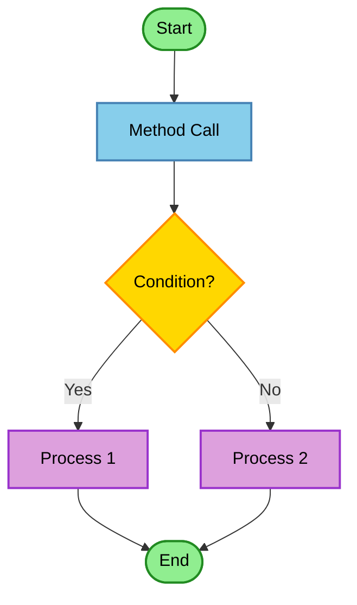

# draw-flow-diagram-excellence Skill

## Overview
Automatically analyzes method/function flows in code and generates Mermaid-format flowchart diagrams for visualization.

## Usage

```
/draw-flow-diagram <className> <methodName>
```

### Examples
```
/draw-flow-diagram UserService authenticate
/draw-flow-diagram OrderProcessor processOrder
```

## Input Parameters
- **className**: Name of the target class to analyze (required)
- **methodName**: Name of the target method to analyze (required)

## How It Works

### 1. Locate Code
- Search the codebase for the specified class name and method name
- Identify the exact method definition location

### 2. Analyze Flow
- Trace the control flow within the method
  - Conditional statements (if/else)
  - Loops (for/while)
  - Method calls
  - Branches and returns
- Track dependencies and calling sequences
- Identify external method invocations

### 3. Generate Mermaid Diagram
- Convert analysis results to Mermaid flowchart syntax
- Node types with color coding:
  - **Start/End nodes** (🟢 Green): Entry and exit points of the method
  - **Method calls** (🔵 Blue): Function/method invocations
  - **Conditional branches** (🟡 Yellow): Decision points (if/else, switch)
  - **Process steps** (🟣 Purple): General processing or operations
  - **Loop structures** (🟣 Purple): Iterative operations
- Edges: Control flow paths with labels

### 4. Return Results
- Present generated Mermaid code
- Format ready for direct rendering

## Output Format



## Limitations
- Complex methods display main flow path only
- External library calls are simplified
- Recursive calls are explicitly marked

## Related Commands
- Search for classes: Use Glob/Grep tools
- Deep code analysis: Use Read tool to examine full method details
